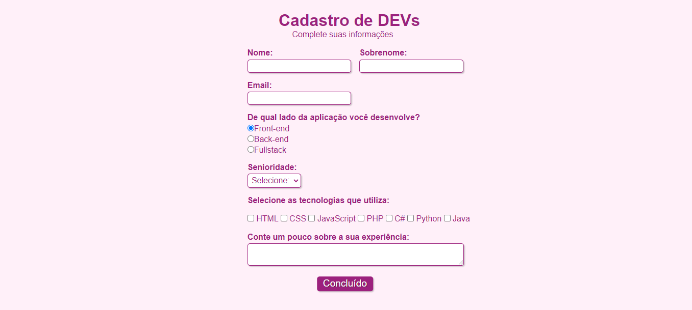

<h1 align="center"> Página de Formulário </h1>

 Projeto desenvolvido com o objetivo de estudar HTML5 e CSS3! 

## 📕 Índice

- [📋 Sobre](#Sobre)
- [🕹 Tecnologias](#Tecnologias)
- [👩🏻💻 Visualizando o projeto](#Visualizando)
- [📲 Contatos](#Contatos)

<!-- About -->

# Sobre

 📋 Este projeto simula uma página web simples para preenchimento de formulários. 

<!-- TECHNOLOGIES -->

# Tecnologias

- 🧩 **Tecnologias**
  - [HTML5](https://developer.mozilla.org/pt-BR/docs/Web/HTML)
  - [CSS3](https://developer.mozilla.org/pt-BR/docs/Web/CSS)

<!-- TECHNOLOGIES -->

# Vizualizando

  1 - Para verificar a funcionalidade da página é recomendado instalar a extensão Live Server no VsCode.   2 - Clicar no arquivo HTML com o botão direito e selecionar a opção "Open with Live Server"

 

 

Ao digitar nos campos correspondentes e clicar no botão concluir uma nova página surge com uma mensagem de sucesso!

 

<!-- CONTACT -->

# Contatos

Sabrynna Lourenço - [Linkedin](https://www.linkedin.com/in/sabrynna-lourenco/) - [Instagram](https://www.instagram.com/sabrynna.ln/) - limasabrynna03@gmail.com

Link do projeto: [https://github.com/sabrynnall/formulario](https://github.com/sabrynnall/formulario)

